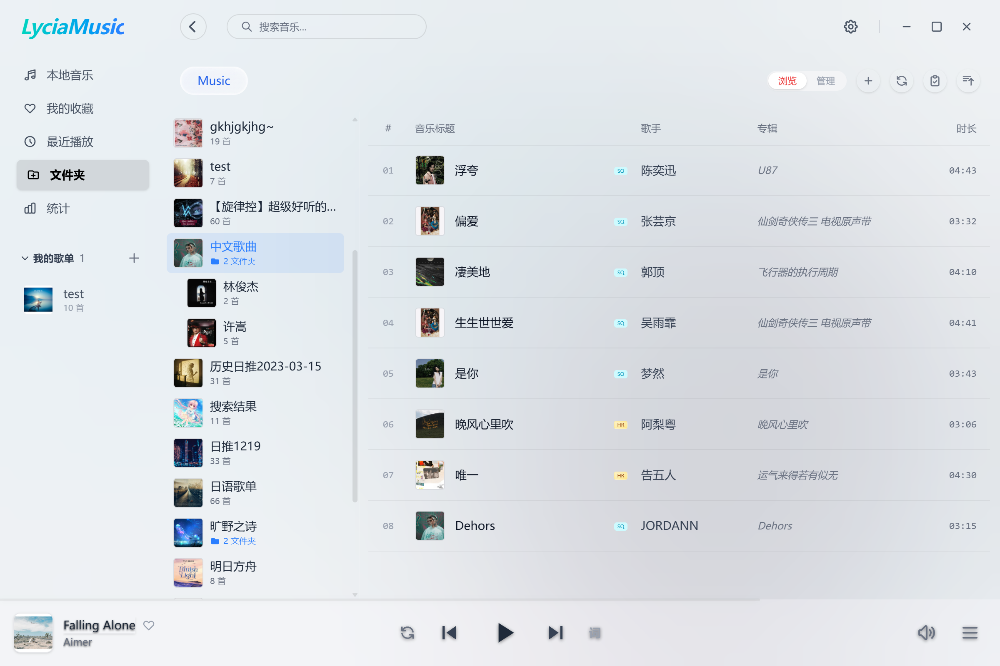
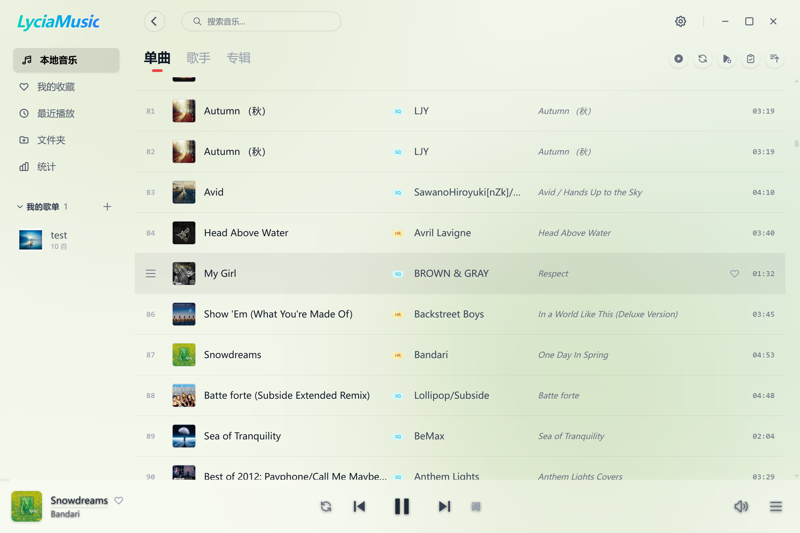
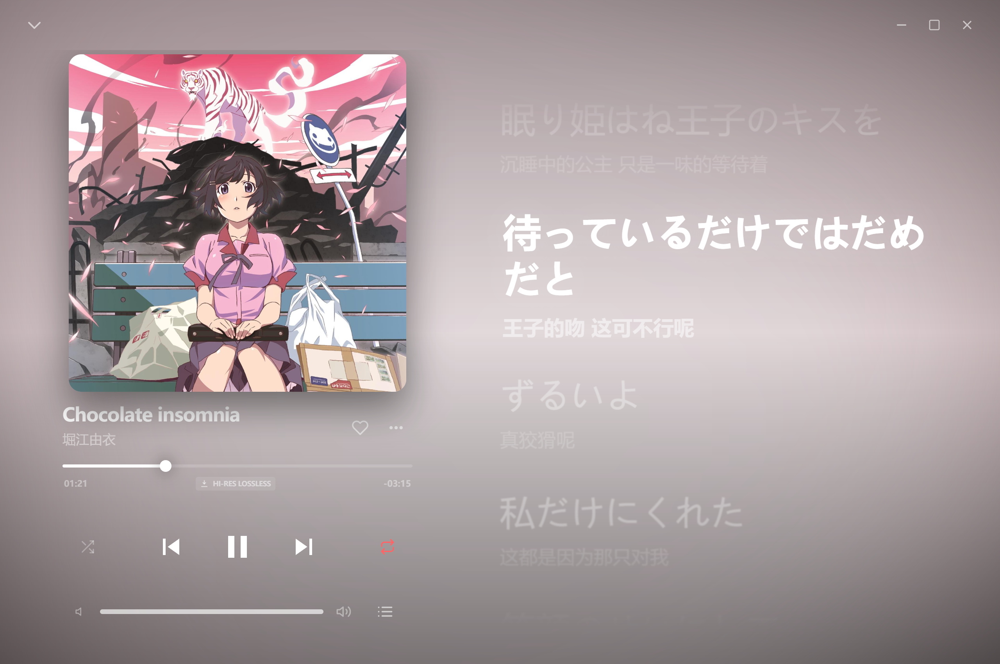
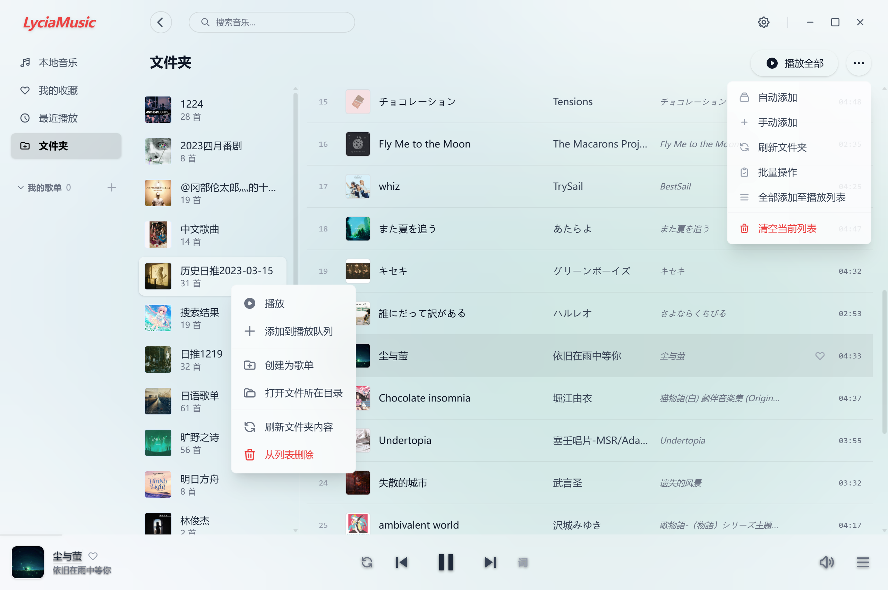
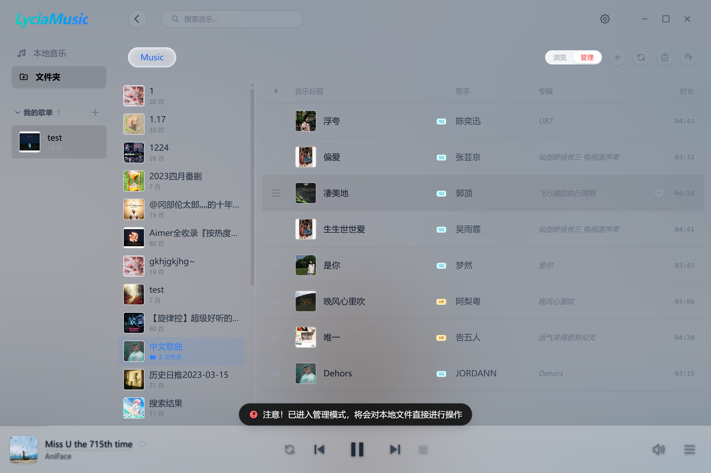
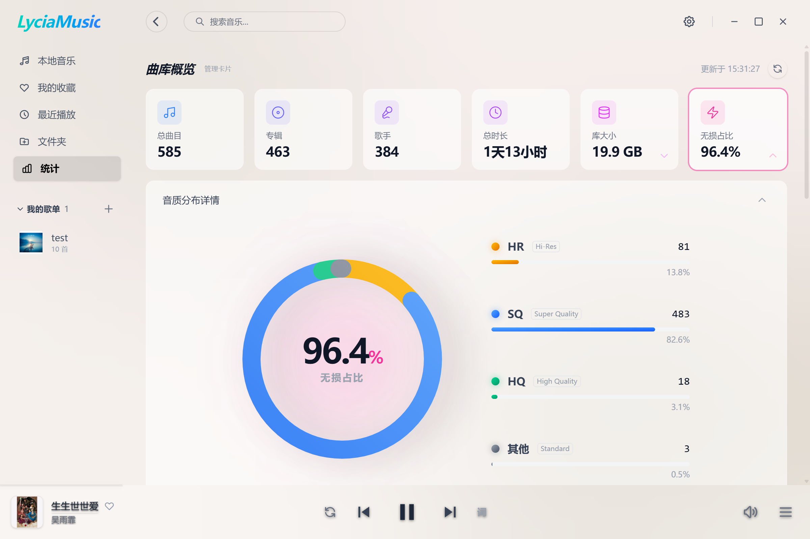
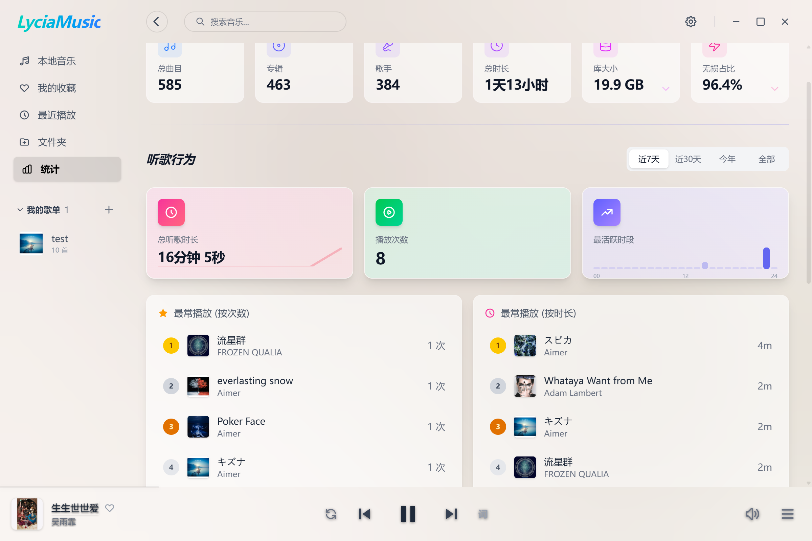
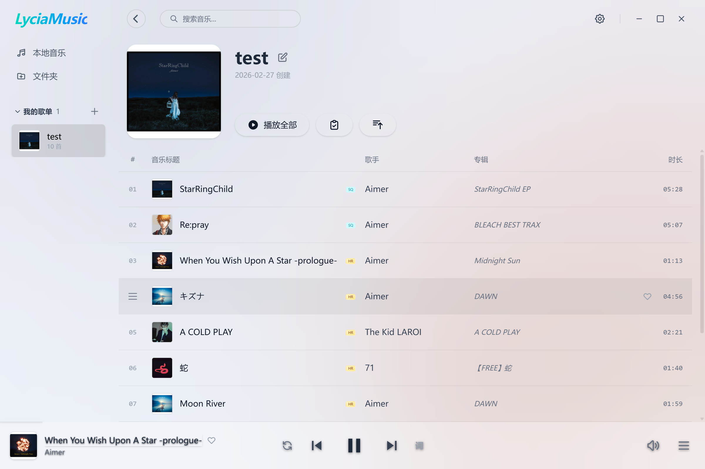
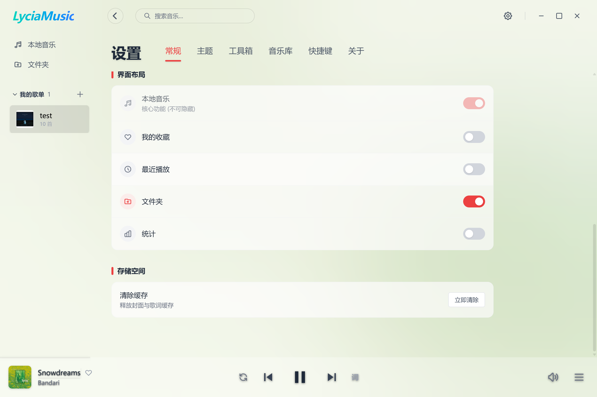

# Lycia Player

<div align="center">

[English](./README_EN.md)

</div>

Lycia Player 是一个基于 **Tauri v2 + Vue 3 + TypeScript + Rust** 的桌面本地音乐播放器。项目重点覆盖本地音乐库管理、播放体验、桌面歌词、媒体控制和文件整理能力，当前主要面向 Windows 本地使用场景。

## 项目提示

本项目基于个人兴趣，使用 AI 工具开发；如果你比较介意这一点，可以忽略本项目。

项目最初是围绕我自己的实际需求开发，后续在持续扩展中。部分功能或特性因为我自己使用较少，测试不够完善，难免存在 bug。如果你在使用中遇到问题，欢迎通过 Issue 提交 bug 或建议。

个人精力有限，开发节奏会比较慢。如果你愿意，也欢迎使用 AI 工具继续扩展功能并提交 PR。

<div align="center">
  
</div>

## 项目状态

- 开发阶段：Alpha
- 主要适配平台：Windows
- 前端技术栈：Vue 3、TypeScript、Vite、Tailwind CSS 4
- 桌面端技术栈：Tauri v2、Rust、SQLite

## 主要功能

- 本地音乐库扫描与增量更新
- 音乐播放控制，包括播放、暂停、进度拖动、音量控制和输出设备切换
- 系统托盘与单实例运行
- 系统媒体控制集成
- 桌面歌词浮窗
- 歌词读取，支持音频标签歌词和同名 `.lrc`
- 统计页面，包括音乐库规模、格式分布、音质分布和部分行为统计
- 文件夹与侧边栏管理
- 文件工具箱，包括预处理、外部标签编辑、批量重命名和刷新入库

## 支持情况

- 扫描音频格式：`mp3`、`flac`、`wav`
- 工具箱重命名预览格式：`mp3`、`flac`、`wav`、`m4a`、`ogg`
- 数据存储：SQLite

## 界面截图

### 首页




### 播放页


### 文件夹


### 文件夹 - 管理模式


### 统计




### 歌单页面


### 设置 - 常规


### 设置 - 音乐库


### 支持 Lyricify


## 环境要求

- Node.js `>= 18`
- Rust stable
- Windows 10 / 11
- WebView2

## 安装与启动

### 安装依赖

```bash
npm install
```

### 开发模式

```bash
npm run tauri dev
```

### 仅前端调试

```bash
npm run dev
```

### 构建产物

```bash
npm run tauri build
```

## 版本管理

项目已经接入一键版本同步流程。执行版本命令时，会自动同步这些文件中的版本号：

- `package.json`
- `package-lock.json`
- `src-tauri/tauri.conf.json`
- `src-tauri/Cargo.toml`
- `src-tauri/Cargo.lock`

### 常用命令

补丁版本递增，例如 `1.2.4 -> 1.2.5`：

```bash
npm run release:patch
```

次版本递增，例如 `1.2.4 -> 1.3.0`：

```bash
npm run release:minor
```

主版本递增，例如 `1.2.4 -> 2.0.0`：

```bash
npm run release:major
```

直接设置指定版本，例如改成 `1.5.0`：

```bash
npm run release:set -- 1.5.0
```

检查所有关键文件中的版本是否一致：

```bash
npm run version:check
```

### 说明

- 以上命令都需要在项目根目录执行
- 版本更新不会自动创建 git tag 或自动提交
- 实际同步逻辑由 `scripts/sync-version.js` 完成
- 版本检查逻辑由 `scripts/check-version.js` 完成

## 项目结构

```plaintext
.
├── src/                        # Vue 前端
│   ├── assets/                 # 静态资源
│   ├── components/             # UI 组件
│   ├── composables/            # 组合式逻辑
│   ├── lib/                    # 前端工具与封装
│   ├── router/                 # 路由定义
│   ├── stores/                 # 状态管理
│   ├── types/                  # 类型定义
│   ├── utils/                  # 通用工具
│   └── views/                  # 页面视图
├── src-tauri/                  # Rust + Tauri 后端
│   ├── src/
│   │   ├── lib.rs              # 命令注册与应用初始化
│   │   ├── player.rs           # 播放能力与媒体控制
│   │   ├── database.rs         # SQLite 初始化与迁移
│   │   ├── statistics.rs       # 统计能力
│   │   ├── toolbox.rs          # 文件工具箱
│   │   ├── window_boundary.rs  # 边界与定位处理
│   │   ├── window_material.rs  # 窗口材质效果
│   │   ├── window_theme.rs     # 主题与外观相关逻辑
│   │   └── music/              # 音乐扫描、标签、封面和文件处理
│   ├── Cargo.toml
│   └── tauri.conf.json
├── scripts/                    # 项目脚本
│   ├── sync-version.js         # 版本同步
│   └── check-version.js        # 版本检查
├── screenshots/                # README 截图资源
├── README.md
└── README_EN.md
```

## 已知限制

- 当前以 Windows 体验为主，macOS 和 Linux 仍需要额外适配和测试
- 部分设置项仍处于占位或半接入状态
- 快捷键设置页尚未完成

## License

AGPL-3.0

歌词相关实现采用并改编了 AMLL（Apple Music-like Lyrics）项目代码，具体来源与补充说明见 [NOTICE](NOTICE)。

---

更新日期：2026-03-12
